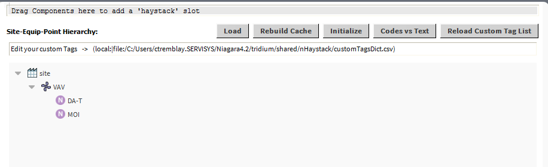

<link href="markdown.css" rel="stylesheet"/>
 
##  NHaystack

NHaystack is an open-source [Niagara4](https://www.tridium.com/us/en/Products/niagara)
module that enables Niagara stations (JACE and WebSupervisor) to act as either servers
_or_ clients in the [Project Haystack](http://project-haystack.org) format, via 
a [RESTful](https://project-haystack.org/doc/docHaystack/HttpApi) protocol.  Using NHaystack, 
external applications receive data that includes essential meta data (tags) 
to describe the meaning of the data. 

When acting as a server, NHaystack automatically generates standard tags for 
all the ControlPoints in your system.  This feature allows for connecting 
immediately to the Niagara Station via Haystack once the NHaystack module has 
been installed, without requiring any further configuration.  It makes 
discovering the points in your station as easy as issuing a simple query.

NHaystack-as-a-server also streamlines the process of adding user-specified 
Haystack tags to Niagara systems, by providing a GUI tool that allows users to 
add the tags directly to Niagara components. Once tags have been defined, the 
data associated with the Niagara components, including the tags, are available 
over the REST communications interface. This combination of the tagging tool
and the Haystack protocol "engine" reduces the effort involved in connecting 
Niagara data to external software applications.

NHaystack can also act as a Haystack client, via a Niagara 4 driver that models
remote servers as Niagara devices. This allows Haystack devices to exist "underneath"
stations.  See Section 7 of this document for an explanation of how that works.

NHaystack is licensed under the
[Academic Free License ("AFL") v. 3.0](http://opensource.org/licenses/AFL-3.0).

The development of NHaystack has been funded by 
[J2 Innovations](http://www.j2inn.com) and
[Conserve It](http://www.conserveit.com.au) and
[Tridium](https://www.tridium.com).

Further contributions have been made by:
* Christian Tremblay, Servisys Inc.
* Stuart Longland, VRT Systems
* Bryant Holland, CBRE|ESI
* Eric Anderson, Tridium
* Andy Saunders, Tridium

### Benefits

* The ability to include meta data tags as part of Niagara data structures 
allows external applications to automatically interpret the meaning of data 
acquired from a Niagara system.
* The Haystack HTTP protocol is efficient and includes features that coalesce
requests to minimize network traffic and message size.
* The NHaystack module includes extensive features under the covers to unify 
real time and historical data structures in Niagara, which greatly simplifies 
access to data, and presentation in third party applications.
* The Haystack REST API tightly defines the relationship between client 
and server machines, allowing for third-parties to integrate easily with your 
equipment and data.

### Key Features

* Provides drop-in support for the Haystack REST API on a Niagara 4 system.
* Unifies the Component and History namespaces
* Allows for arbitrary queries of the station based on Haystack tags
* Makes it easy to create a Site-Equip-Point Hierarchy view of your system.
* Provides a standard Niagara 4 driver so that remote Haystack servers can be 
modelled inside of N4.

### Usage
The nhaystack distribution archive comes with 2 modules and a patched
'haystack-rt.jar' file for a number of different version of Niagara 4:
* nhaystack-rt.jar
* nhaystack-wb.jar

First of all, drop both of these jar files into your '<niagara_home>\modules' 
folder and restart your workbench.  

Next, select the patched version of the 'haystack-rt.jar' file that 
corresponds to the version of Niagara 4 you are using.  The new version of 
'nhaystack' is not supported before version 4.4.93.40.  If you are using a 
later version and a patched 'haystack-rt.jar' file is not available then 
most likely this means that the version you are using already has the 
appropriate modifications to that module.

If the Niagara 4 installation is a Web Supervisor then all you need to 
do is restart any running stations on the platform, connect to the stations 
and drop the NHaystackService into the running station.

For use on a "Jace" style platform the minimum installation required is
for the 'nhaystack-rt.jar' file to be installed.  Only install 'nhaystack-wb.jar'
if you intend to access the Java based built-in workbench through a web browser.
To install the modules on a "Jace" type of platform, use the standard
Niagara Workbench tools.  As indicated above, a patched version of the 
'haystack-rt.jar' file is required.  This must also be installed on the 
target platform.

### 1. Using NHaystack as a server

To get started with exposing a Niagara 4 station as a Haystack server, install 
nhaystack-rt.jar into a Niagara 4 station.  Then open the nhaystack palette in 
Workbench, and drag-and-drop the NHaystackService onto the "/Services" folder 
of your station.

This is all you need to do to get rolling.  Your station is now automatically
serving up all its ControlPoint objects and Histories as haystack 
`point` [recs][rec], via the 
[Haystack REST Api](https://project-haystack.org/doc/docHaystack/HttpApi). 
Many of the tags that are defined as being associated with `points`, like 
`kind`, `unit`, `tz`, `his`, `cur`, etc. are automatically generated for you.

#### 1.1 The Cache
The NHaystackService maintains an in-memory cache of all the Haystack records
it finds in your Niagara Station.  When you first add the NHaystackService to
your station it needs to be enabled.  This can be done from the Property Sheet
of the NHaystackService.  When the service initialises it builds the in-memory
cache of the Haystack records it finds.  

This process also happens when the station is started or restarted.  If you 
examine the output from the Application Director of your station you will see
a number of messages logged there advising of the status of the cache building
process.

If at anytime whilst the station is running you make a change to any tags or 
site/equipment entities then it you must make sure you execute a cache rebuild.
This can be done by finding the NHaystackService in your station and
right-clicking on the service.  From the context menu that appears select 
_Actions->Rebuild Cache_.  If you do not do this then your changes will not
appear in any queries to the NHaystackService from either internal or external
clients.

#### 1.2 The Haystack Servlet
When using the NHaystack module in Niagara and configuring your station as a
Haystack server you will most likely want to enable the servlet.  The 
NHaystackService comes with a built-in, fully compliant implementation of the
Project Haystack REST API specification.  This servlet enables external 
Haystack clients to interact with your Niagara Station.

To enable the built-in servlet that implements the Project Haystack REST API
navigate to the Property Sheet of the NHaystackService in your station and you
will find the property that enables the servlet.  Additionally there is an 
opportunity to provide a custom name for the servlet.  By default the servlet
name is _haystack_ and it is recommended that this default name remains unchanged
as other clients will be expecting this servlet name as a defacto standard.

It is recommended to enable the servlet immediately after installing the
NHaystackService so that other clients are able to interact with your station.

### 2. How point recs are generated

In Niagara 4, ControlPoints and Histories exist in separate namespaces. 
There is one object in the station database which represents the current state 
of the point, (including its current value, actions to command it, and so 
forth), and a different object to represent its historical log of 
timestamp/value pairs. 

However, in Haystack, a `point` rec models both of these concepts in one
object.  A `point` rec can have both a `cur` tag,
which indicates the `point` has capability for subscription to its real-time 
current value, and it can have a `his` tag, which indicates that a 
`point` is historized with a history log of timestamp/value pairs.

NHaystack handles this mismatch by unifiying the namespaces.
It automatically maps ControlPoints and Histories together 
so that only one Haystack rec is generated, with both a `cur` tag and a 
`his` tag.  If only one of the objects is present, then either 
the `cur` tag or this `his` tag is generated, but not both.  Lets 
look at a couple of examples showing how this works.  

#### 2.1 A simple station

First lets take a simple example of a Niagara station that has two 
ControlPoints in it , with no History collection for those ControlPoints.
The station will look similar to this:

    station:|slot:/AHU1/NumericWritable
    station:|slot:/AHU1/BooleanWritable
    history:/my_station/AuditHistory
    history:/my_station/LogHistory

This station will automatically have four `point` recs: two for the 
ControlPoints, and two for the Histories.  The first two will have a `cur` 
tag, but no `his` tag, and the second two will have a `his` tag but 
no `cur` tag.

    {point,cur} station:|slot:/AHU1/NumericWritable           
    {point,cur} station:|slot:/AHU1/BooleanWritable           
    {point,his} history:/my_station/AuditHistory 
    {point,his} history:/my_station/LogHistory   

Now lets add a NumericCov extension to the NumericWritable and enable it.
Whenever we make a structural change to a station, by adding or removing a
Component or History, we must invoke an action on the NHaystackService called
`rebuildCache`.  Invoking `rebuildCache` causes the 
NHaystack Server to traverse through the entire station and rebuild 
all of its internal data structures, so it can keep track of how everything 
in the station is interrelated.

After we invoke `rebuildCache`, the station will look like this:

    {point,cur,his} station:|slot:/AHU1/NumericWritable
    {point,cur}     station:|slot:/AHU1/BooleanWritable
    {point,his}     history:/my_station/AuditHistory
    {point,his}     history:/my_station/LogHistory
    ----            history:/my_station/NumericWritable

The station still has the same four `point` recs.  However, a `his` tag has
been added to the NumericWritable `point`.  If a [hisRead][hisRead] on that 
`point` is performed, the NHaystack Server will fetch the timestamp/value pairs 
for the associated History.  The History for NumericWritable does not have its 
own rec created, because it has been unified with the NumericWritable.

By the way, the `id` tags that are generated for these recs consist of
a single character, either "c" or "h" (which indicates whether the rec comes
from the ComponentSpace or HistorySpace), followed by a ".", and then followed
by a Uri-friendly Base64 encoding of either the slotPath or the historyId.

As a final example from this simple station, lets delete the NumericWritable
and then invoke `rebuildCache`.  The station now looks like this:

    {point,cur} station:|slot:/AHU1/BooleanWritable           
    {point,his} history:/my_station/AuditHistory 
    {point,his} history:/my_station/LogHistory   
    {point,his} history:/my_station/NumericWritable    

We still have four `point` recs.  However, the first rec is now gone.  In its
place we have a `point` rec for the NumericWritable History.  Note that this 
rec has a different `id` than the rec that has disappeared.

#### 2.2 A more complex station

Now lets look at a more complex station -- one that is similar to what
one often sees on a Niagara Supervisor.  A very frequent case for 
supervisors is that they just import lots of Histories from jaces.

    ----        station:|slot:/Drivers/NiagaraNetwork/jace1/Histories/Remote_NumericWritable
    ----        station:|slot:/Drivers/NiagaraNetwork/jace1/Histories/Remote_BooleanWritable
    ----        station:|slot:/Drivers/NiagaraNetwork/jace2/Histories/Remote_NumericWritable
    ----        station:|slot:/Drivers/NiagaraNetwork/jace2/Histories/Remote_BooleanWritable
    {point,his} history:/supervisor/AuditHistory
    {point,his} history:/supervisor/LogHistory
    {point,his} history:/jace1/NumericWritable
    {point,his} history:/jace1/BooleanWritable
    {point,his} history:/jace2/NumericWritable
    {point,his} history:/jace2/BooleanWritable

This station has six recs:  two for the station's own audit and log Histories, 
and four for the imported Histories.  Note that the four NiagaraHistoryImport 
objects do not have a `point` associated with them.

Now lets change the station by importing the ControlPoints for the first Jace,
and running `rebuildCache`.  Here is what the station looks like now:

    {point,cur,his} station:|slot:/Drivers/NiagaraNetwork/jace1/points/NumericWritable
    {point,cur,his} station:|slot:/Drivers/NiagaraNetwork/jace1/points/BooleanWritable
    ----            station:|slot:/Drivers/NiagaraNetwork/jace1/Histories/Remote_NumericWritable
    ----            station:|slot:/Drivers/NiagaraNetwork/jace1/Histories/Remote_BooleanWritable
    ----            station:|slot:/Drivers/NiagaraNetwork/jace2/Histories/Remote_NumericWritable
    ----            station:|slot:/Drivers/NiagaraNetwork/jace2/Histories/Remote_BooleanWritable
    {point,his}     history:/supervisor/AuditHistory
    {point,his}     history:/supervisor/LogHistory
    ----            history:/jace1/NumericWritable
    ----            history:/jace1/BooleanWritable
    {point,his}     history:/jace2/NumericWritable
    {point,his}     history:/jace2/BooleanWritable

You'll notice that the two Histories from jace1 no longer have their own 
auto-generated rec.  Instead, the two imported ControlPoints know about those 
Histories, and will export them via [hisRead][hisRead].  NHaystack creates this 
linkage by analyzing the relationships between imported ControlPoints found 
under a NiagaraPointDeviceExt, imported NiagaraHistoryImports found under a 
NiagaraHistoryDeviceExt, and the Histories found in the station's HistorySpace.

#### 2.3 curVal and curStatus

If NHaystack creates a [cur][cur] tag, then it will also create a
[curStatus][curStatus] tag, and (usually) a [curVal][curVal] tag.

In N4, a Status value is a set of status flags and an associated value, 
and at least in theory a given 
Status can contain any combination of the flags.  However, in the haystack tagging
system, `curStatus` always only has exactly one value -- one of "ok", "fault",
"down", "disabled", or "unknown".

NHaystack translates from an N4 Status to curStatus by checking the following
N4 Status flags in order:

    N4 ok       maps to `curStatus`:"ok"
    N4 disabled maps to `curStatus`:"disabled"
    N4 fault    maps to `curStatus`:"fault"
    N4 down     maps to `curStatus`:"down

*Anything else* (overridden, null, alarm, stale, unackedAlarm) is simply
translated into `curStatus`:"ok".

NHaystack creates a `curVal` tag *only* if `curStatus` is "ok" *and* the N4
status is not null. This means that if a point in N4 has the "null" status flag
set, then it will be reported with a curStatus of "ok", but it will simply not
have a curVal.

### 3. How to tag points in Niagara

#### 3.1 Tagging via the "haystack" slot

For many use cases of NHaystack, you will not need to do any explicit tagging
on the station.  However, sometimes you want to actually add tags to the 
recs that are generated.  NHaystack supports this via the following convention: 
if there is a slot called "haystack" on a Component, and that slot is of type 
`nhaystack:HDict`, then the tags which are saved in that slot are exported
in the rec along with all the auto-generated tags.  There is a Workbench
FieldEditor for HDict which allows you to edit these tags.  In addition, this
FieldEditor shows you all the auto-generated tags (though you cannot edit 
them). 

You can add this slot via the SlotSheet View for the Component.  However this
is very tedious when you have to do it to many Components, so nhaystack 
provides a better way.  There is a Workbench View on NHaystackService that has 
an area that you can drag-and-drop Components into. The area says "Drag 
Components here to add a 'haystack' slot".  When you drop Components there,
they will have a `nhaystack:HDict` "haystack" slot added automatically.

There is a special tag called "axAnnotated" that is automatically generated
for those Components that have a "haystack" slot.  This can be helpful if you
need to query your system to figure out which parts of it have already been
annotated.

By the way, you may be wondering why `nhaystack:HDict` doesn't just appear in 
the palette.  The reason for this is that `nhaystack:HDict` is a `baja:Simple`, 
and sadly Simples cannot be placed in a palette.

Whenever you alter a tag with the FieldEditor, you usually need to run 
`rebuildCache`. Its best to just get in the habit of running it any time you
change a tag or alter the structure of a station.

#### 3.2 Tagging using the Niagara Interface
To do...community contributions accepted!

#### 3.3 Refs and Relations
To do...community contributions accepted!

#### 3.4 A better Workbench Interface
The nHaystack Service View is really simple. There's no need to rebuild 
everything but adding a few buttons add a lot of flexibility to the view. 
The displayed text has also been modified so we can get rid of ~ codes and retrieve 
familiar characters. For those who want to see ~ codes, just toggle the 
Codes vs Text button.

If you change your local dictionary file 
(local:|file:/C:/Users/<USERNAME>/Niagara4.<version>/tridium/shared/nHaystack/customTagsDict.csv) 
just push the "Reload Custom Tag List" button and all new haystack slot will use 
the new file to tag your points based on name.

You can also click on the label "Edit your custom Tags" and you will be 
redirected to the workbench text editor.  Note that if the file doesn't exist, 
you will get an error. To make this feature work, create a folder named 
"nHaystack" in your shared folder. Then create a simple file named 
customTagsDict.csv.

The format of the file is the following ::

	name,markers
	DA-T,discharge air temp sensor
	DAT-SP,discharge air temp sp

### 4. How site and equip tags work

In addition to tagging `point` recs, you may also want to include `site` 
and `equip` recs in your station, and link everything together via 
`siteRef` and `equipRef` pointers.  NHaystack does support 
creating this [site-equip-point hierarchy][structure]. Let's see how it works.

#### 4.1 Site tagging

Lets use our simple example station from section 2.1, except we'll add 
an EnumWritable to it. Note that this time we have also listed an entry for 
the parent "AHU1" folder in our simplified view of the station.  

    ----        station:|slot:/AHU1
    {point,cur} station:|slot:/AHU1/NumericWritable
    {point,cur} station:|slot:/AHU1/BooleanWritable
    {point,cur} station:|slot:/AHU1/EnumWritable
    {point,his} history:/my_station/AuditHistory
    {point,his} history:/my_station/LogHistory

If you look in the nhaystack palette, you'll see that there are Components for
Site and Equip. Drag a Site over and drop it anywhere in the ComponentSpace, 
and then run `rebuildCache`.  The station will now look something like this:

    {site}      station:|slot:/Richmond
    ----        station:|slot:/AHU1
    {point,cur} station:|slot:/AHU1/NumericWritable           
    {point,cur} station:|slot:/AHU1/BooleanWritable           
    {point,cur} station:|slot:/AHU1/EnumWritable           
    {point,his} history:/my_station/AuditHistory 
    {point,his} history:/my_station/LogHistory   

Site and Equip already have a "haystack" slot, so you don't have to add
one via the SlotSheet.  Bring up the HDict FieldEditor for the
Site, you'll see that there are quite a few tags you can fill out, like the
various "geo" tags.

#### 4.2 Equipment versus Controllers

In Niagara, Controllers are modeled as an object of type `driver:Device`.
Generally speaking, all ControlPoints exist underneath one of these Devices.

Howerver, in nhaystack there is no one-to-one relationship between an `equip` 
rec and a Device.  Any Device can have its `points` belong to more than one 
`equip`,  and any `equip` can have `points` from more than one Device.  

This flexibility allows us to get away completely from the network-centric 
view of the world that one finds in an N4 Station.  You can create 
representations of your data that reflect the real-world equipment on your 
site, rather than the layout of your controller network.

The following two sections, 4.3 and 4.4, explain in more detail how this works.

#### 4.3 Explictly tagging points with equipRef

Lets continue with our example station from 4.1, and create an `equip` which 
references out `site`.  Then lets have a `point` reference the `equip`.

First, drag an Equip over from the palette and place it anywhere in the 
station.  Underneath the Site is a good place for it.  Name it "TrashCompactor". 

Then edit the `equip` and assign its `siteRef` so that it references "Richmond".  
Then run `rebuildCache`.  Next, edit "/AHU1/BooleanWritable", and give it an 
`equipRef` that references "TrashCompactor".  Run `rebuildCache` again.

The station will now look like this:

    {site}                                 station:|slot:/Richmond
    {equip,siteRef="/Richmond"}            station:|slot:/Richmond/TrashCompactor
    ----                                   station:|slot:/AHU1
    {point,cur}                            station:|slot:/AHU1/NumericWritable
    {point,cur,equipRef="/TrashCompactor"} station:|slot:/AHU1/BooleanWritable
    {point,cur}                            station:|slot:/AHU1/EnumWritable
    {point,his}                            history:/my_station/AuditHistory
    {point,his}                            history:/my_station/LogHistory

We have now successfully created a very simple site-equip-point hierarchy.
Our nav tree looks like this:

    Richmond
        TrashCompactor
            BooleanWritable

#### 4.4 Implicitly tagging points with equipRef

We could now continue and mark every single `point` under 
"AHU1" as belonging to some `equip`.  However, that is a lot of drudgery, and
its also prone to error.  NHaystack provides us with a better way to do this.

Drag an Equip from the palette, drop it under the "AHU1" folder, and call it 
"my_equip".  Edit the `equip` so that its its `siteRef` references "Richmond".  

Next, add an optional "Str" tag called `navNameFormat` to the `equip`, and set 
its value to "%parent.displayName%".  The reason for doing this will soon 
become apparent.

Then rebuild the cache. Now observe what has happened:

    {site}                                 station:|slot:/Richmond
    {equip,siteRef="/Richmond"}            station:|slot:/TrashCompactor
    ----                                   station:|slot:/AHU1
    {equip,siteRef="/Richmond"}            station:|slot:/AHU1/my_equip
    {point,cur,equipRef="/AHU1/my_equip"}  station:|slot:/AHU1/NumericWritable
    {point,cur,equipRef="/TrashCompactor"} station:|slot:/AHU1/BooleanWritable
    {point,cur,equipRef="/AHU1/my_equip"}  station:|slot:/AHU1/EnumWritable
    {point,his}                            history:/my_station/AuditHistory
    {point,his}                            history:/my_station/LogHistory

    Site-Equip-Point Nav Tree:
        Richmond
            TrashCompactor
                BooleanWritable
            AHU1
                NumericWritable
                EnumWritable

All of the `points` underneath AHU1, except BooleanWritable, have an 
auto-generated `equipRef` tag which references "/AHU1/equip".  This happens 
because, during the cache rebuild process, NHaystack noticed that those 2 
`points` had an ancestor which had an `equip` child.  Since those `points` were 
not explicitly annotated with an `equipRef`, NHaystack automatically linked 
them to that ancestors Equip object.

By implicitly tagging `points` this way, we can automatically generate large 
numbers of `equipRef` tags without having to visit every `point`.  

By the way, the reason that we added the `navNameFormat` to the `equip` was so
that it would show up in our nav tree as "AHU1", rather than "my_equip". By
default the `navName` of any object is just its N4 displayName, but you
can rig the nav tree so that alternate names are used. This is important 
because you must always ensure that all the children of a nav tree item
have a unique `navName`.

Lets duplicate the "AHU1" folder (an then `rebuildCache` of course) to show
how easy creating large nav trees is.  

Before we do though, we'll fix 
our BooleanWritable so it has a better `navNameFormat`.  Edit the tags for the
BooleanWritable and set its `navNameFormat` to something like 
"%parent.displayName%_%displayName%".  By performing this step, we ensure that 
all of the points underneath "TrashCompactor" in the nav tree will have a 
unique `navName`.  Now our nav tree looks like this:

    Site-Equip-Point Nav Tree:
        Richmond
            TrashCompactor
                AHU1_BooleanWritable
            AHU1
                NumericWritable
                EnumWritable

Now simply duplicate AHU1 and run `rebuildCache`.  Our station will look like
this:

    {site}                                 station:|slot:/Richmond
    {equip,siteRef="/Richmond"}            station:|slot:/TrashCompactor
    ----                                   station:|slot:/AHU1
    {equip,siteRef="/Richmond"}            station:|slot:/AHU1/my_equip
    {point,cur,equipRef="/AHU1/my_equip"}  station:|slot:/AHU1/NumericWritable
    {point,cur,equipRef="/TrashCompactor"} station:|slot:/AHU1/BooleanWritable
    {point,cur,equipRef="/AHU1/my_equip"}  station:|slot:/AHU1/EnumWritable
    ----                                   station:|slot:/AHU2
    {equip,siteRef="/Richmond"}            station:|slot:/AHU2/my_equip
    {point,cur,equipRef="/AHU2/my_equip"}  station:|slot:/AHU2/NumericWritable
    {point,cur,equipRef="/TrashCompactor"} station:|slot:/AHU2/BooleanWritable
    {point,cur,equipRef="/AHU2/my_equip"}  station:|slot:/AHU2/EnumWritable
    {point,his}                            history:/my_station/AuditHistory
    {point,his}                            history:/my_station/LogHistory

    Site-Equip-Point Nav Tree:
        Richmond
            TrashCompactor
                AHU1_BooleanWritable
                AHU2_BooleanWritable
            AHU1
                NumericWritable
                EnumWritable
            AHU2
                NumericWritable
                EnumWritable

### 5. Keeping your data set consistent

#### 5.1 Fixing broken refs

Occasionally when you are working on setting up the relationships between
recs in a station, you will delete a Component that has other Components 
referencing it.  For instance, in the example in 4.4, if we delete 
"TrashCompactor", then both of our BooleanWritables will have an invalid 
equipRef.

To fix this problem, there is an action on NHaystackService called 
`removeBrokenRefs` that you can invoke.  This action deletes all of the refs 
in the station that do not reference a valid rec.  Each time a broken ref is 
deleted, a message is also generated in the station log telling you which 
Component was fixed.

In a future version of NHaystack, there will be a view on NHaystackService
that will make it easier for you to find the broken refs and fix them.

#### 5.2 Using TimeZone Aliases

Sometimes an N4 TimeZone (a.k.a BTimeZone) do not map cleanly into a 
Haystack TimeZone (a.k.a HTimeZone).  This happens when the BTimeZone uses
an offset-style TimeZone ID, like "GMT-05:00", rather than a valid 
[Olson](https://en.wikipedia.org/wiki/Tz_database) 
ID, like "America/New_York".  When this occurs, you will see errors in your log 
output that look like this:

    ERROR [11:59:01 04-May-13 GMT-05:00][nhaystack] Cannot create tz tag: Unknown tz: GMT-05:00

In cases like this, NHaystack simply omits the `tz` tag for the historized
`point` in question.

However, NHaystack also allows you to  provide a custom mapping that overcomes 
this problem, via the "timeZoneAliases" folder on your BHaystackService.  Go to 
the nhaystack palette in Workbench, drag a "timeZoneAlias" onto the 
"timeZoneAliases" folder, and configure it so that the bogus N4 TimeZone ID, 
like "GMT-05:00", is mapped onto a proper HTimezone, such as 
"America/New_York".  Now when NHaystack is attempting to generate the `tz` tag, 
it will know how to proceed when it encounters non-Olson timezones.

In a future version of NHaystack, there will be a view on NHaystackService
that will help you find which timezones are invalid in your dataset, but for 
now you must go through your log output, find the "Cannot create tz tag"
error messages, and copy-and-paste the offending TimeZone ID into a 
timeZoneAlias that maps onto the 'real' HTimezone.

Note that if the machine that you are running Workbench from is mis-configured,
it will provide a default HTimeZone of the form "Etc/GMT-5" in your 
timeZoneAlias.  You should not use the HTimeZones from the "Etc" 
region unless you are really sure of what you are doing.  Instead, always use 
the proper geographic region-and-timezone, like "America/New_York".

### 6. How IDs are generated

Each haystack rec must have an ID that uniquely identifies the object that the
rec models.

By default, nhaystack generates IDs based on the slotPath of components (or the
history ID for histories that are not associate with a point).  E.g:

    slot:/Foo/SineWave1 --> C.Foo.SineWave1

    history:/nhaystack_simple/AuditHistory --> H.nhaystack_simple.AuditHistory

In the above example, the "C" prefix stands for the ComponentSpace, and the "H"
stands for the HistorySpace.

Note that IDs are bi-directionally encoded -- you can always recreate the 
slotPath from an ID and vice-versa.

Special characters in the slotPath are handled by replacing the "$" character 
with a "~" character.  The sole exception to this rule is that "$20", which
represents a single " " character, is replaced with a dash, "-", to improve the 
readability of the IDS.  E.g:

    slot:/Foo/Sine$2fWave1 --> C.Foo.Sine~2fWave1
    slot:/Foo/Sine$20Wave1 --> C.Foo.Sine-Wave1

If there is a site-equip-point hierarchy created in the station, then nhaystack
will use that to generate the ID rather than the slotPath.  E.g. if the 
SineWave in the first example was tagged up with an equip and a site, then 
its generated ID might look something like this:

    slot:/Foo/SineWave1 --> S.Carytown.AHU1.SineWave1

In this case, there are actually two IDs that can be used to resolve the rec --
the slotPath version, and the Site-Equip-Point version.

Note that older versions of nhaystack used a Base64 encoding of the slot path,
which looks something like this:

    c.c2xvdDovRm9vL1NpbmVXYXZlMg~~
    h.L25oYXlzdGFja19zaW1wbGUvQXVkaXRIaXN0b3J5

Nhaystack no longer generates IDs with this form, but it can resolve them.

### 7. Using NHaystack as a client

NHaystack can also model remote haystack servers as N4 devices.  This is done 
via a standard N4 driver that maps the Haystack protocol into the N4 driver 
framework.

You do *not* need to have an NHaystackService installed in your station to do 
this -- the driver is a standalone piece of functionality.  In fact you 
_shouldn't_ have an NHaystackService in the station unless you are acting 
simultaneously as a server and a client.

To get started, open the nhaystack palette in Workbench, open the "drivers" 
sub-folder of the palette, and drag-and-drop the NHaystackNetwork onto the 
"/Drivers" folder of your station.  Then drag an NHaystackServer so that it is 
underneath your NHaystackNetwork.

Next, configure the internetAddress, uriPath, and credentials slots on the
NHaystackServer.  The internetAddress adress should just be the hostname or IP 
address (plus a colon and then the port number if something other than port 
80 is being used).  The uriPath should be of the form "api/myProjectName" if 
the remote server is running FIN|Stack or SkySpark.  If the remote server is an 
N4 station that is running nhaystack-as-a-server, then the uriPath should 
simply be "haystack".

After you've configured the NHaystackServer, manually do a ping to make sure its
connected.  Once connectivity has been established, you can go to the "points" 
and "histories" folders of the NHaystackServer object, and discover points and 
histories just like any other Niagara driver.

Note that currently, the driver imports ["Str" points](http://project-haystack.org/tag/point)
as Baja BStringPoint and BStringWritable objects, even if the haystack point
has an enum tag which specifies a list allowable values.  BEnumPoint and 
BEnumWritable objects are currently not created by the driver.  Instead, the 
enum tag is stored as a 'range' facet on the N4 ControlPoint.

[rec]: http://project-haystack.org/doc/TagModel#entities
[structure]: http://project-haystack.org/doc/Structure
[hisRead]: http://project-haystack.org/doc/Ops#hisRead
[cur]: http://project-haystack.org/tag/cur
[curStatus]: http://project-haystack.org/tag/curStatus
[curVal]: http://project-haystack.org/tag/curVal

#### 7.1. Exporting history to another Project Haystack server

The NHaystack client can be used to push history stored on the Niagara station
to an upstream Project Haystack-compatible server.  This feature has been
successfully tested on both NHaystack server and on VRT WideSky, but should
work with any Project Haystack server.

The NHaystack History Export Manager can be found by right-clicking on
Histories beneath your Project Haystack server instance and selecting Views →
NHaystack History Export Manager.  From here, clicking Discover will present
you with a list of all the histories on the station.

After selecting the histories of interest, click Add, and you'll be presented
with a dialogue box listing the histories and the options to be set.

From this form, each history must be associated with the `Ref` of the `point`
to which it will write its historical data.  There are three ways this can be
done.

##### 7.1.1 Manual association of points via the Add form

The lowest-common denominator method here is to use a standard Project
Haystack client to get a list of valid points from your server, then manually
copying the `id` of each `point` into the `Id` field on the Add form.

This should work for any Project Haystack server.  The `point` is assumed to
carry a `his` tag, be of the correct `kind` for the type of history being
exported, and either carries a `tz` tag matching that of the history, or is on
a server that supports time-zone conversion.

For more detail on tagging assumptions, see section 7.1.2 below.

##### 7.1.2 Automatic look-up using `n4Station` and `n4HistoryId`.

Depending on the Project Haystack server, it may be easier to retrieve a list
of histories from the station and tag the points so the station can find them.
Such a list can be obtained from WorkPlace via the following procedure:

1. Double click on your station's "History" space (it'll take you to a chart
   view)
2. Press CTRL+L to bring up the ORD dialogue
3. At the end of the text field (after `history:`), add
   `bql:select id, recordType, timeZone from /`
4. From the File menu, select Export.
5. Choose "Text to CSV" and "Save to File"
6. Enter the path where you want the file and click OK.

Filter out of that list the histories you want to upload.  To associate a
history in this list to a point in your asset model, tag the point with the
following two tags:

* `n4Station` (Str): should be the name of your Niagara station (as seen in
  brackets in the WorkPlace navigation tree, e.g. `mystation`).
* `n4HistoryId` (Str): should be the ID of the history taken from your BQL
  query dump.

The `point` will also need to have `kind` and `tz` set up properly:

* Histories of type `history:NumericTrendRecord` should be tagged with
  `kind=="Number"`.  Ideally these should also be tagged `unit` (Str) with an
  appropriate Project Haystack unit.
* Histories of type `history:BooleanTrendRecord` should be tagged with
  `kind=="Bool"`
* Histories of type `history:EnumTrendRecord` should be tagged with
  `kind=="Str"` and ideally should also be tagged `enum` (Str) with a
  comma-separated list of valid enum values.
* Histories of other types should be tagged with `kind=="Str"`.

##### 7.1.3 Automatic creation of points

If the server supports the `createRec` call, then points will be automatically
created on the Project Haystack server.  The station will issue a HTTP POST
instruction to the server's `createRec` endpoint with a single-row grid
containing the following columns:

* `name` (Str): This will be the name of the control point, or if that's not known,
  the name of the history.
* `dis` (Str): This will be the Display Name of the control point (or
  history), or if those are blank/null/not known, the `name` of the new point.
* `point` (Marker)
* `his` (Marker)
* `kind` (Str): The point kind; one of `Str`, `Bool` or `Number`, depending on
  the type of history being exported.
* `tz` (Str): The timezone of the history (this is set in the Add dialogue,
  default is automatically determined from the history database).
* `n4Station` (Str): The name of the Niagara station exporting the history
* `n4HistoryId` (Str): The ID of the history being exported
* `n4SlotPath` (Str): If known, the slot path of the control point (may be
  omitted if not known).
* `unit` (Str): If known and history is a `NumericTrendRecord`, the
  measurement unit for the control point
* `enum` (Str): If known and history is a `EnumTrendRecord`, the list of valid
  enumeration values for the control point

It is assumed that `siteRef` and `equipRef` are optional and can be filled in
later via other CRUD ops by the end user.  The `n4Station` and `n4HistoryId`
should be used to obtain listings of the orphaned `point` entities so they can
be associated with the correct `site` and `equip`.

#### 7.2 Fine tuning payload sizes

The number of records exported at a time can be tuned by configuring the
Upload Size.  This is a count of the number of rows used in each `hisWrite`
request.  It defaults to 10000, which depending on the server may work, or may
result in a "Request Entity Too Large" error message from the server.

In such cases, the driver will automatically divide this value by two and try
again, so if the server experiences difficulty processing the set number of
records, you'll see smaller payloads (5000, 2500, 1250, etc) attempted.  (It
will not go any smaller than 1 record.)

You can manually set this value to any payload size suits your requirements.

#### 7.3 Setting an alternate start point

By default, exports begin at the very first record in the history.  This can
be configured via the "Upload From Time" field.  This specifies the start
point for the very next export task.

It can be used to "skip over" invalid data that was captured during the
commissioning process, as well as to re-upload data in the event that data is
lost or corrupted on the upstream Project Haystack server.

## Version History Notes
### Version 2.1.2
- Small updates to this documentation file have been made for clarification
- This version contains a bug fix for when a `hisRead` was made and no records were 
found.  Previously a NullPointerException was thrown, this is now handled and an 
empty grid is returned as a response via the REST API.
- This release has been tested with Niagara 4.4.73.24
